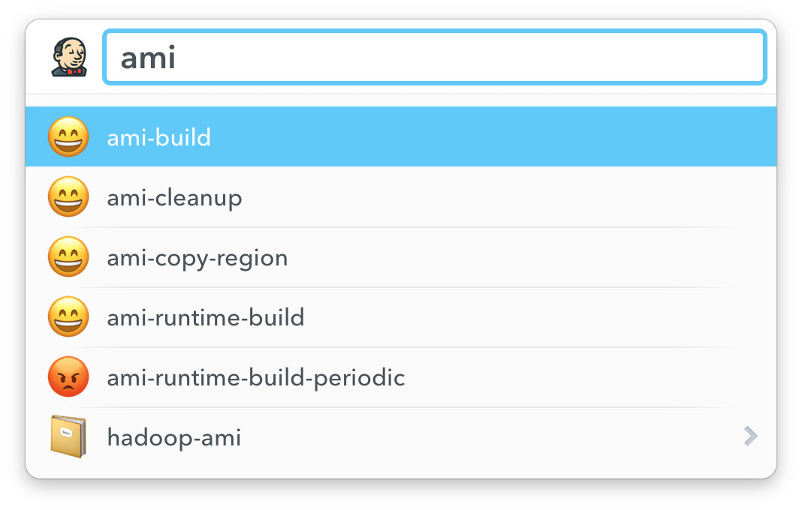

# Launchbar Actions

## Bitbucket


### Usage

Allows you to search in the list of repositories of your Bitbucket.
- Press enter to get a list of interesting urls (home, ssh-git, https-git,..)
- Press command-enter to open the home page of the repository on bitbucket
- Press option-enter to paste the ssh-git clone url

### Setup
Create a file in your home directory `.bitbucket-launchbar.json` containing
```json
{
    "user": "your-user-id",
    "password": "your-password",
    "baseUrl": "https://bitbucket..."
}
```

## Jenkins



### Usage

Allows you to search in the list of jenkins builds. You can navigate in a multi-branch build by pressing enter. Happy smiley means (😄) the build was successfull. Angry (😡) means the build is broken. Sweating smiley (😅) means the build is in progress.

- Press enter to navigate to the homepage of the build in Jenkins.
- If you are on a multi-branch project, press command-enter to navigate to the homepage of that project. Pressing shows you all the builds of the branches.

### Setup
Create a file in your home directory `.jenkins-launchbar.json` containing
```json
{
    "userId": "your-user-id",
    "apiKey": "api-key-of-your-user",
    "baseUrl": "https://jenkins..."
}
```

## Jira


### Usage
Allows you to list the issues in your current sprint and to lookup a specific issue by id. If you are on the 'Jira' action, press space to enter an issue id. Press enter to show the issues of your current sprint.

- Pressing enter gives you the details of the issue (key, summary, start of a branchname, detail and project urls).
- Press command-enter to navigate to the detail-page of the issue
- Press option-enter to paste the issue id.

### Setup
Create a file in your home directory `.jira-launchbar.json` containing
```json
{
    "user": "your-user-id",
    "password": "your-password",
    "baseUrl": "https://jira...",
    "jql": "project=XX and sprint in openSprints() and status in (Open, 'In Progress', Review) and issuetype not in subtaskIssueTypes() order by status asc"
}
```
You can customize the JQL query to fetch your issues in your current sprint.
